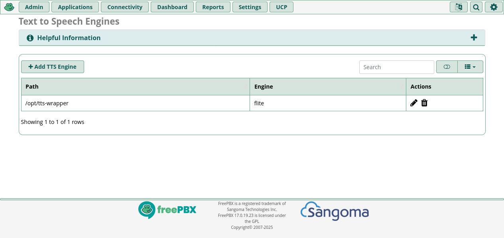

# TTS Wrapper

# Install TTS

Install TTS globaly:

```
apt install pipx
PIPX_HOME=/opt/pipx PIPX_BIN_DIR=/usr/local/bin PIPX_MAN_DIR=/usr/local/share/man pipx install tts

# Copy tts-wrapper in /opt/
chown asterisk:asterisk /opt/tts-wrapper

```

# Usage


